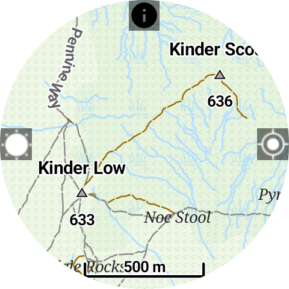
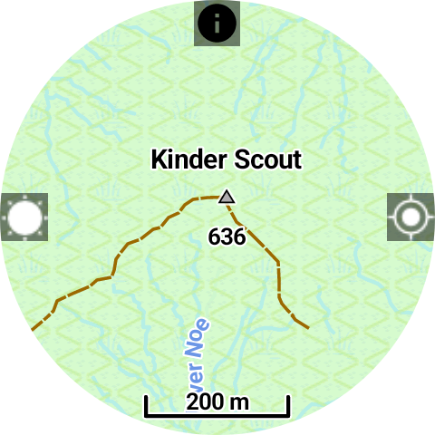

# Wear OS Offline Maps & GPX Tracker

This simple Wear OS app allows you to:

* Download OSM maps of the whole world for offline use.  
* Import GPX files into the watch and display them on the map for navigation.

  


## Features

Designed for hiking, trail running, and other outdoor sports:

* Prevent the screen from dimming for continuous navigation.  
* Disable touch input, useful in rain or if clothing covers the screen.  
* Display progress along an active GPX track.  

## GPX Import Methods

Currently, GPX tracks can be imported in the following ways:

1. **RideWithGPS / Pastebin**  
   - Tracks must be public.  
   - **RWGPS may not work due to recent changes—we are trying to find a fix.**  
   - **Pastebin tracks load into the correct folder but may not display.**  
   - Use the **8-digit code from the RWGPS URL** or the **last 8 letters from the Pastebin URL** when importing.  

2. **Manual import using Bugjaeger**  
   - Install [Bugjaeger](https://play.google.com/store/apps/details?id=com.android.bugjaeger) on your phone and pair via wireless debugging.  
   - Keep your watch on charge.  
   - Navigate to:  
     ```
     storage/emulated/0/Android/Data/com.keeperrl.offlinemapsforwearos/files/download
     ```  
   - At the top of Bugjaeger, click the **up arrow** and import the GPX file you want.  
   - Currently, this is the most reliable method until a new service can be integrated.

## Instructions

1. Download the `offlinemaps.apk` file from this repository and sideload it onto your watch.  
2. Run the app and enable GPS permission.  
3. Tap and hold the screen to enter the menu, then download a map of your area. (Placing the watch on a charger may help speed up the download.)  
4. When the map is downloaded and location is acquired, the map will display on the screen. Swipe to scroll and use rotation input (physical bezel, touch bezel, crown) to zoom in/out.  
5. Click on a track name to activate it—it will now be shown on the map.  
6. Click the "sun" icon on the left to prevent the screen from dimming.  
7. Click the "info" icon on top to toggle the information overlay (clock, battery, track progress).  
8. Click the "location" icon on the right to stop the map from centering on your location.  
9. Press the back button to toggle touch input (a "lock" icon appears when touch is disabled).  

## Credits

This app was made possible thanks to the [Mapsforge library](https://github.com/mapsforge/mapsforge).
