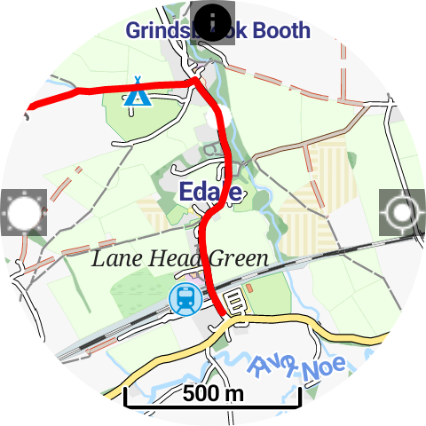
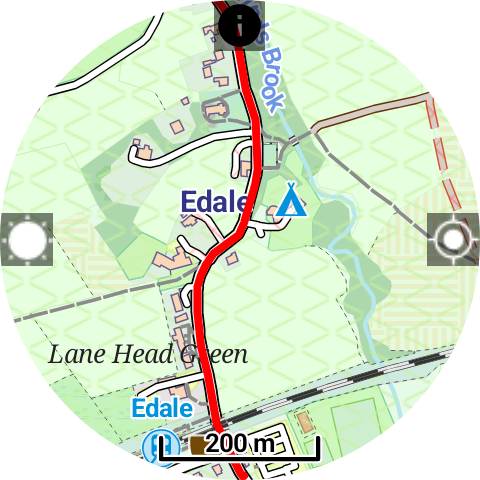

# Wear OS Offline Maps & GPX Tracker

This simple Wear OS app allows you to:

* Download OSM maps of the whole world for offline use.  
* Import GPX files into the watch and display them on the map for navigation.

  
  
  
  

---

## Features

Designed for hiking, trail running, and other outdoor sports:

* Prevent the screen from dimming for continuous navigation.  
* Disable touch input, useful in rain or if clothing covers the screen.  
* Display progress along an active GPX track.  

---

## GPX Import Methods

Currently, GPX tracks can be imported in the following ways:

1. **OpenStreetMap Traces**  
   - Tracks must include elevation and time data.  
   - Copy the numeric ID from the OSM trace URL, e.g.:  
     ```
     https://www.openstreetmap.org/traces/12056327/data
     ```  
     Here `12056327` is the ID you enter in the app.  
   - Import the GPX into OSM first if editing is needed.  
   - The app downloads the GPX from OSM and displays it on your watch.  

2. **Manual import using Bugjaeger**  
   - Install [Bugjaeger](https://play.google.com/store/apps/details?id=eu.sisik.hackendebug) on your phone and pair via wireless debugging.  
   - Keep your watch on charge.  
   - Navigate to:  
     ```
     storage/emulated/0/Android/Data/com.keeperrl.offlinemapsforwearos/files/download
     ```  
   - At the top of Bugjaeger, click the **up arrow** and import the GPX file you want.  
   - Currently, this is the most reliable method until a new service can be integrated.  

> **Note:** RWGPS and Pastebin imports are currently disabled or unreliable. The app now uses OpenStreetMap for GPX import.  

> **Tip:** If your GPX does not include elevation or time data, you can use [GPX.studio](https://gpx.studio) to edit your GPX:  
> * Add elevation and time data.  
> * Set a speed or pace if needed.  
> * Save the GPX, then import it to OSM, and finally import into the app.  

---

## Instructions

1. Download the `OfflineMaps#2.apk` file from this repository and sideload it onto your watch.  
   - **This APK is the most up-to-date version.**  
2. Run the app and enable GPS permission.  
3. Tap and hold the screen to open the menu.  
   - **First**, download the map for your area.  
   - **Then**, you can import a GPX file.  
4. When the map is downloaded and location is acquired, the map will display on the screen. Swipe to scroll and use rotation input (physical bezel, touch bezel, crown) to zoom in/out.  
5. Click on a GPX track name to activate it—it will now be shown on the map.  
6. Click the "sun" icon on the left to prevent the screen from dimming.  
7. Click the "info" icon on top to toggle the information overlay (clock, battery, track progress).  
8. Click the "location" icon on the right to stop the map from centering on your location.  
9. Press the back button to toggle touch input (a "lock" icon appears when touch is disabled).  

---

## Credits

This app was made possible thanks to the [Mapsforge library](https://github.com/mapsforge/mapsforge).
